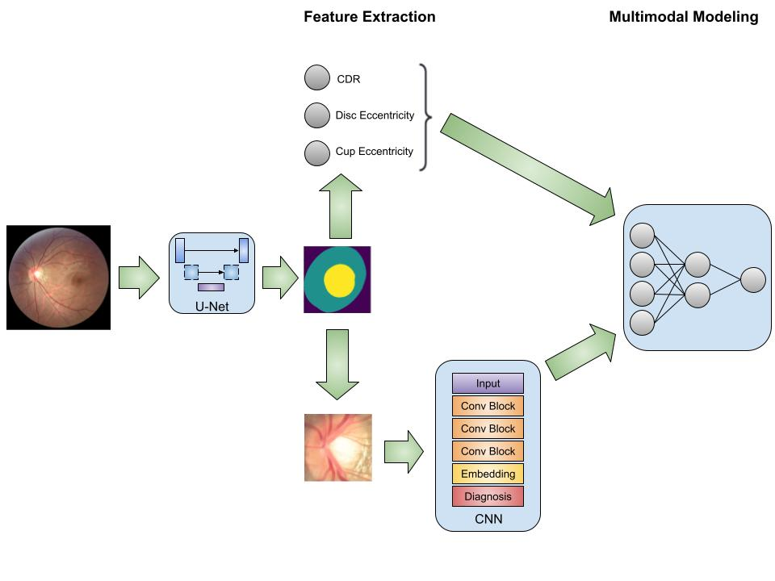

# Enhanced Multimodal Diagnosis of Glaucoma Using Deep Convolutional Networks
**Summary:** We propose a method that incorporates both state-of-the-art deep learning-based image extraction features as well as standard metrics used in clinical practice to provide accurate Glaucoma detection irrespective of imaging and clinical conditions. Embeddings extracted by a ResNet-50 model on a fundus image as well as numerical features indicative of Glaucoma (CDR, cup eccentricity, and disk eccentricity) are concatenated to provide a comprehensive diagnosis.

Authors: Sauman Das, Arnav Jain, Audhav Durai, Sameer Gabbita, Aditya Vasantharao, Vishal Kotha

<a href="https://drive.google.com/drive/folders/1Nu3oFAGeGaQROS9Xt8DxDkwu1ffvd2bB?usp=sharing/" target="_blank">Dataset</a> | 
<a href = "https://doi.org/10.1109/DSAA54385.2022.10032439" target="_blank">Paper</a>
